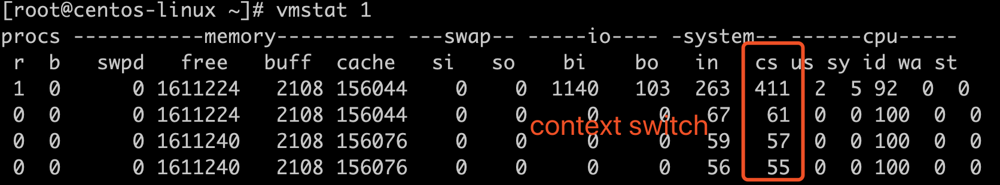
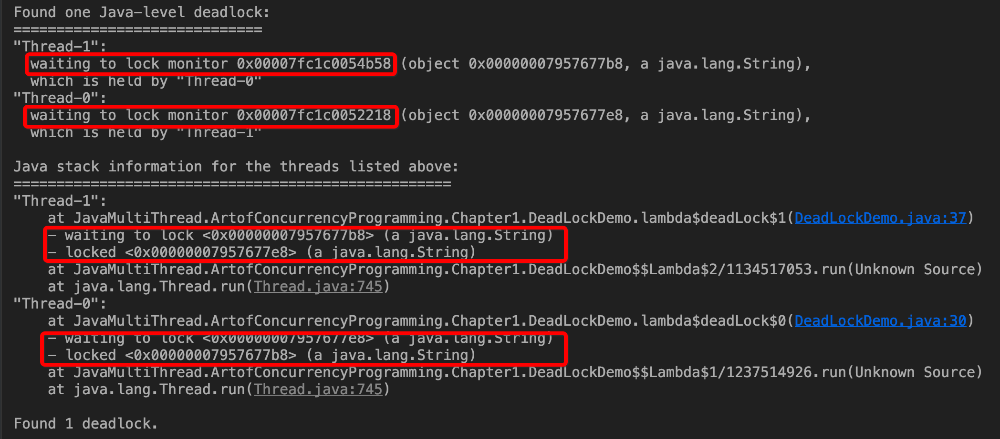

# 第一章 并发编程的挑战

## 一、上下文切换

​	CPU通过时间片分配算法循环执行任务，当前任务执行一个时间片后会切换到下一个任务。在切换之前会保存上一个任务的状态，以便下一次切回这个任务时，可以再加载这个任务的状态。任务从保存到再加载的过程是一次**上下文切换**。上下文切换会影响多线程的执行速度。

### 1.`vmstat`命令测量上下文切换的次数

```shell
vmstat 1 // 每隔一秒采集一次
```



注：cs表示上下文切换次数/s。

###2.分析线程dump文件

```shell
grep java.lang.Thread.State dumpfile | awk '{print $2$3$4$5}' | sort | uniq -c
```

该命令统计所有线程分别处于什么状态，如下所示：

```markdown
- RUNNABLE-----运行或可运行状态
- TIMED_WAITING(on object monitor) ----调用Object.wait(long)方法
- TIME_WAITING(parking) ---- 调用LockSupport.parkNanos(long)方法
- TIME_WAITING(SLEEPING) ---- 调用Thread.sleep(long)方法
- WAITING(on object monitor) ---- 调用Object.wait()方法
- WAITING(parking) ---- 调用LockSupport.park()方法
```

参考:

1.[三个实例演示 Java Thread Dump 日志分析](https://www.cnblogs.com/zhengyun_ustc/archive/2013/01/06/dumpanalysis.html)

2.[各种 Java Thread State 第一分析法则](https://www.cnblogs.com/zhengyun_ustc/archive/2013/03/18/tda.html)

3.[性能分析之-- JAVA Thread Dump 分析综述](https://blog.csdn.net/rachel_luo/article/details/8920596)

## 二、死锁



​	以上是死锁的线程堆栈显示情况。

​	


