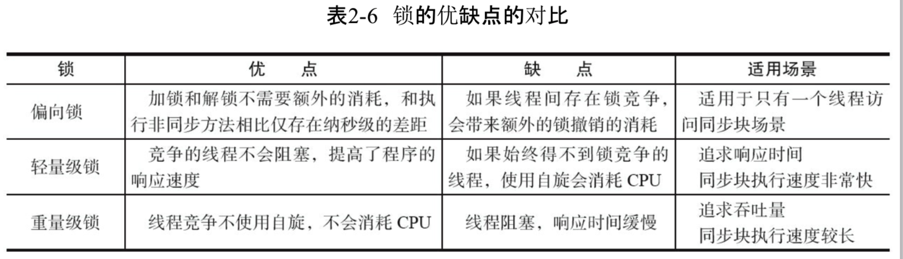

# 第二章 Java并发机制的底层实现原理

## 一、volatile关键字

​	volatile是轻量级的synchronized，在并发编程中保证了共享变量的可见性。如果一个字段被声明为volatile，Java内存模型确保所有线程看到这个变量的值是一致的。

实例：

```java
// Java代码：
instance = new Singleton();  // instance是volatile变量

// 转变为汇编代码：
0x01a3de1d: movb $0x0, 0x1104800(%esi);
0x01a3de24: lock addl $0x0,(%esp);
```

​	有volatile修饰的变量在写操作时会多出第二行代码，lock前缀的指令在多核处理器下会引发下列两件事：

- 将当前处理器缓存行的数据写回系统内存；
- 这个写回内存的操作会使在其他CPU里缓存了该内存地址的数据无效，使用时强制从内存重新读取。

## 二、synchronized的实现原理和应用

​	Java中的每一个对象可作为锁。对于普通同步方法，锁是当前实例对象；对于静态同步方法，锁是当前类的Class对象；对于同步代码块，锁是synchronized括号里配置的对象。

​	JVM规范中synchronized是基于进入和退出Monitor对象来实现方法和代码块同步的。实现细节上，代码块同步是通过monitorenter和monitorexit指令实现的，而方法同步使用另一种方式。

###1.Java对象头

​	**synchronized用的锁存在Java对象的对象头里。**

### 2.锁的类型

​	Java中锁一共有四种状态：**无锁状态、偏向锁状态、轻量级锁状态和重量级锁状态**，这几种状态会**随着竞争情况逐渐升级**。**锁可以升级但不能降级**，意味着偏向锁升级为轻量级锁后不能降级为偏向锁。

#### (1)偏向锁

​	因为大多数情况下，锁不仅不存在多线程竞争，而且**总是由同一个线程多次获得**，为了让线程获得锁的代价更低而引入偏向锁。获取细节见P13-14。

​	关闭偏向锁：JVM参数   -XX:-UseBiasedLocking=false，**程序默认进入轻量级锁状态**。

#### (2)轻量级锁

​	多线程竞争获取锁时，使用**自旋**操作获取锁。**在轻量级锁解锁时，如果解锁失败，表示当前锁存在竞争，锁会膨胀为重量级锁。**

### 3.锁的优缺点对比



## 三、原子操作的实现原理

​	原子操作是不可中断的一个或一系列操作。

### 1.处理器实现原子操作

- 使用**总线锁**保证原子性。总线锁指使用处理器提供的一个LOCK#信号，当一个处理器在总线上输出此信号时，其他处理器的请求将被阻塞，那么该处理器可以独占共享内存。
- 使用**缓存锁**保证原子性。缓存锁指内存区域如果被缓存在处理器的缓存行中，并且在LOCK操作期间被锁定，则当它执行锁操作回写到内存时，处理器不在总线上声言LOCK#信号，而是修改内部的内存地址，并允许它的缓存一致性机制来保证操作的原子性，因为缓存一致性机制会阻止同时修改由两个以上处理器缓存的内存区域数据，当其他处理器回写已被锁定的缓存行的数据时，会使缓存行无效。

### 2.Java实现原子操作

​	在Java中通过锁和CAS的方式实现原子操作。

#### (1) 使用循环CAS实现原子操作

​	JVM中的CAS操作利用了处理器提供的CMPXCHG指令实现。自旋CAS实现的基本思路是循环进行CAS操作直到成功为止。

#### (2) CAS实现原子操作的三大问题：

- ABA问题。使用`AtomicStampedReference`解决(版本号)。
- 循环时间长开销大。自旋CAS如果长时间不成功，会给CPU带来非常大的执行开销。
- 只能保证一个共享变量的原子操作。

#### (3) 使用锁机制实现原子操作

​	偏向锁、轻量级锁、重量级锁。
