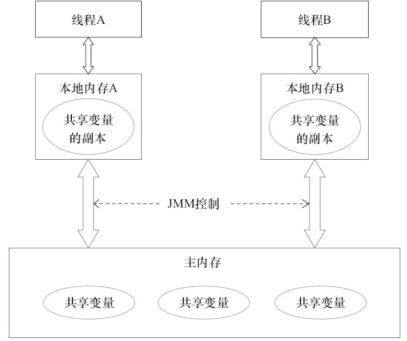
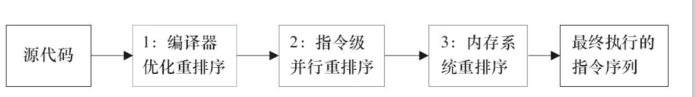
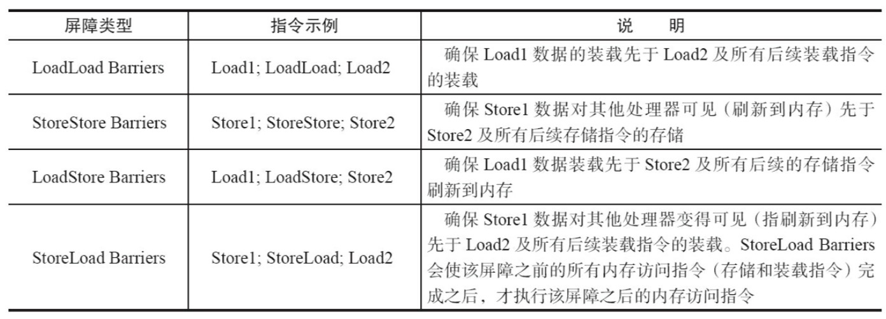

# 第三章  `Java`内存模型

## 一、`Java`内存模型基础

### 1.并发编程模型的两个关键问题

​	线程之间如何通信和线程之间如何同步。

### 2.`Java`内存模型的抽象



### 3.重排序

​	重排序分为编译器优化的重排序、指令级并行的重排序、内存系统重排序。



### 4.内存屏障

​	为了保证内存可见性，`Java`编译器在生成指令序列的适当位置会插入内存屏障指令来禁止特定类型的处理器重排序。JMM把内存屏障分为4类。



### 5.happens-before规则

- 程序熟悉怒规则
- 监视器锁规则
- volatile变量规则
- 传递性

## 二、`volatile`的内存语义

### 1.`volatile`的特性

- 可见性：对一个`volatile`变量的读，总是能看到任意线程对这个变量最后的写。
- 原子性：对任意单个`volatile`变量的读/写具有原子性，但类似`volatile++`这种符合操作不具备原子性。

### 2.`volatile`写-读建立的`happens-before`关系

- 当写一个`volatile`变量时，`JMM`会把该线程对应的本地内存中的共享变量值刷新到主内存。

- 当读一个`volatile`变量时，`JMM`会把该线程对应的本地内存置为无效。线程接下来从主内存读取共享变量值。

  `volatile`内存语义的实现见书`P42`

## 三、锁的内存语义

- 当线程释放锁时，`JMM`会把该线程对应的本地内存中的共享变量刷新到主内存中。

- 当线程获取锁时，`JMM`会把该线程对应的本地内存置为无效。使得被监视器保护的临界区代码必须从主内存中读取共享变量。

  锁释放-获取的内存语义，与`volatile`变量写-读的内存语义相比：**可知锁释放与`volatile`写有相同的内存语义；锁获取与`volatile`读有相同的内存语义。** 锁内存语义的实现见`P50`

##四、`final`域的内存语义

​	`final`域的重排序规则：

- 在构造函数内对一个`final`域的写入，与随后把这个被构造对象的引用赋值给一个引用变量，这两个操作不能重排序。
- 初次读一个包含`final`域的对象的引用，与随后初次读这个`final`域，这两个操作之间不能重排序。

##五、`happens-before`规则

> 1) 程序顺序规则
>
> 2) 监视器锁规则
>
> 3) `volatile`变量规则
>
> 4) 传递性
>
> 5) start() 规则。如果线程A执行操作ThreadB.start()(启动线程B)，则A线程的ThreadB.start()操作happens-before线程B的任意操作。
>
> 6) join() 规则。如果线程A执行操作ThreadB.join()并成功返回，则线程B中的任意操作happens-before于线程A从ThreadB.join()操作成功返回。

## 六、双重检查锁定与延迟初始化

### 1.非线程安全的双重检查锁定

```java
public class DoubleCheckingLock {
	private static Instance instance;

	public static Instance getInstance() {
		if (instance == null) { // instance不为null, 但instance可能还没初始化
			synchronized (DoubleCheckingLock.class) {
				if (instance == null) {
					instance = new Instance();
				}
			}
		}
		return instance;
	}

}
```

### 2.基于`volatile`的解决方案

```java
public class SafeDoubleCheckingLock {
    // volatile变量
   private volatile static Instance instance;

   public static Instance getInstance() {
      if (instance == null) {
         synchronized (SafeDoubleCheckingLock.class) {
            if (instance == null) {
               instance = new Instance();
            }
         }
      }
      return instance;
   }

}
```

### 3.基于类初始化的解决方案

```java
public class InstanceFactory {
	// 静态类
	private static class InstanceHolder {
		public static Instance instance = new Instance();
	}

	public static Instance getInstance() {
		// 初始化 InstanceHolder
		return InstanceHolder.instance;
	}

}
```

### 4.总结

​	字段延迟初始化降低了初始化类或创建实例的开销，但增加了访问被延迟初始化的字段的开销。大多数时候，正常的初始化要优于延迟初始化。如果确实需要对**实例字段**使用线程安全的延迟初始化，可使用**基于`volatile`的方案**；如果需要对**静态字段**使用线程安全的延迟初始化，可使用**基于类初始化的方案**。